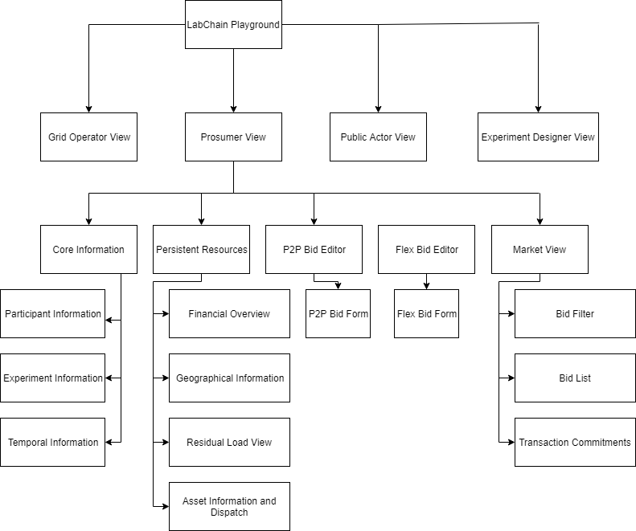

# LabPlayground

The Energy Economic Lab Playground is an experimental research infrastructure development project that is meant for the project author to play around with technologies the author is not very familiar with (in particular with Angular CLI). 

Its goal is to investigate good practices, architecture and code snippets of how an energy economic lab can be developed for a subsequent project where it is actually properly implemented.
The energy economics lab is intended as a piece of research infrastructure for investigating flesh-and-blood actor interaction within use cases for blockchain-based peer-to-peer energy trading systems involving synthetic actors. 

This experiment project involves Angular CLI 7.3.0. and some mock services for the inclusion of external sources that will eventually be added 

## Architecture 

Following [Tomas Trajan](https://medium.com/@tomastrajan/6-best-practices-pro-tips-for-angular-cli-better-developer-experience-7b328bc9db81), the project separates the code in a commonly shared core module and (dependency-less) SharedModule, as well as a bunch of feature modules. The feature modules encapsulate views and functionality for the different types of actors (Prosumers, Grid Operator, Experiment Designer and Public Actor) in their respective modules, that communicate indirectly with one another, through the external data ressources (EDM layer and blockchain layer, as abstracted through the in-memory-service.ts for now).

Since the view of the lab is (for now) conceptualized as a single-page application with dynamic components, no routing is necessary. For this reason, no routing modules were included with the respective feature (role) modules. This might well be changed (and can be easily added) in later versions, staying consistent with [the Angular CLI documentation](https://angular.io/guide/lazy-loading-ngmodules).
This would particularly be the case if the modules for the different actors should be loaded lazyly, which would probably be a good idea, since every type of user has exactly one type of feature module they use once they are logged in through the welcome page.
Due to the authors lack of experience with Angular CLI, it is however not clear which would be the best solution for this matter.

## Components

The Playground is embedded in a project using two further components: An open data platform (located within the [WindNODE Energiedatenmarktplatz](https://datenmarkt.windnode.de/dataset)) and a blockchain layer within the WindNODE Blockchain Smart Energy project (internal documents only).
The other components are mostly developed indepently from this component, and will be joined according to (yet internal) interface specifications. 
Within this project, these components are represented by the [Mock EDM Service](src/app/core/mock-edm.service.ts) and the [Blockchain Transaction Service](src/app/core/blockchain-transaction.service.ts), which will function as the interface at a later stage (probably with some respective refactoring).    

...other components 

### UI Components

The code within this repository describes the (stateful) frontend of the lab. 
In the following, the components are organized by role the user plays within an experiment, and the the user interface components are (with the exception of the landing page) developed independently of one another, with regards to the role of the user within the experiment.

The frontend application consists of two websites, a welcome page for the selection of the respective experiment and the role of the user within it, and the page the user interacts with during an experiment.
The [welcome page](src/app/core/welcome/welcome.component.html) serves as router and identification page, in order to get the user to the right experiment in the right role. 
Upon insering a code in the input field and logging in, the user is routed to the respective page detailed below.
 
The UI components are organized as follows (with a detailed description found below or in the respective documentation files):

.  

#### Prosumer components

Since for the early stages of this development the prosumer perspective is in the foreground, (for now) this documentation focuses on these elements. 
The prosumer view (as single page view) is implemented through the [Prosumer component](src/app/prosumer/prosumer.component.html) in the [prosumer module](src/app/prosumer/prosumer.module.ts).
As showed in the UI component overview, it contains prosumer information (if the prosumer is set), experiment information (if information exists), the [time component](src/app/core/time/time.component.html), the [persistent resource display](src/app/prosumer/persistent-resource-display/persistent-resource-display.component.html) and the [market view](src/app/prosumer/market-view/market-view.component.html).
It thus keeps experiment-persisting data (in addition to the asset data kept in the [persistent resource display](src/app/prosumer/persistent-resource-display/persistent-resource-display.component.html) data and the experiment data as managed by the [experiment instance](src/app/core/data-types/ExperimentInstance.ts) and [experiment description](src/app/core/data-types/ExperimentDescription.ts)), and comprises the components managing the operations of a Prosumer.

##### Persistent Resource Components

Persistent resources are those assets that persist throughout an experiment. While their state changes, i.e. they are operationally dynamic, their attributes/characteristics are static. 
Currently, persistent resources are financial assets (tokens), geographical information (meter point / feed-in coordinates) and technical assets. 
The latter resources can be distinguished by type, currently by controllable generators, non-controllable generators, loads and storage facilities.
Persistent resources are stored in the prosumer instance (which is asyncronously fetched from the [Experiment Instance Loader Service](src/app/core/experiment-instance-loader.service.ts) as an observable), and are displayed dynamically once their data is fetched.

Geographical information is managed by the [Feed-in point display](src/app/prosumer/feed-in-point-display/feed-in-point-display.component.html), through passing data as Coordinates, while technical assets are based on data of the respective data types (as specified in the [respective typescript files](src/app/core/data-types)).
The technical assets are displayed by listing their technical parameters and their generation/load/storage curve, as a chart as implemented through the [ChartJS library](https://www.chartjs.org/docs/latest/). 
When existent, the chart is represented by a *canvas* element in the html markup, represented by *ViewChild* data in the typescript (.ts) file. State information is held in the .ts file and enriched with further vizualization information in a *Chart* object.

Specification of the different asset types, their data, vizualization and dispatch will follow soon.

##### P2P Bid Component

##### Market View

## User Manual

While being an experimental project / playground, and thus not intended for users other than the core developer, I can't prevent you from trying it out yourselves, so the Angular-generated readme information for the usage of the software is put in the [user manual](docs/userManual.md).

## Developers Guide

Since the Energy Economics Lab this playground is meant to be preliminary research for is envisioned to be a versatile tool for the investigation of a number of use cases and research questions, considerable need for software development effort is foreseen. 
With this recognition, and in accordance to the views of the core author, collaborative, open source development is to be encouraged. In order to motivate other developers and help them understand the structure, thoughts and technical aspects of this project, a [developers guide](docs/developersGuide.md) will be developed.  

## Application State

Since the application also serves as a learning environment for Angular CLI for the author, no consistent style exists when several options are available.
Instead, different solutions or concepts are used to help evaluate which one is most appropriate for use.

The application is furthermore not yet connected to external APIs, so much data is test data from static, hard-coded data structures.
