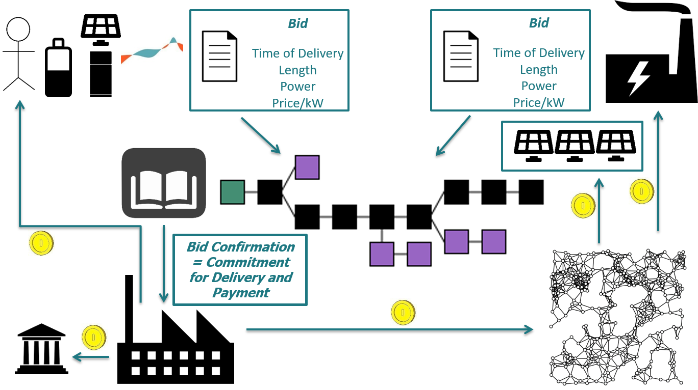

# Software Overview
LabChain implements a synthetic energy economics environment research tool that can be used for investigating system designs of transformed energy systems.
It is situated in a research context and is aimed at a variety of research questions. Its focus is, however, on peer-to-peer (P2P) energy trade and energy flexibility markets.

It incorporates four different roles for software interaction, as detailed in the following.
Out of these three are core actors in energy systems (namely Prosumers, Grid Operators and the Public Actor), while the remaining actor is the crucial actor in the research context: The Researcher, who constructs and supervises the experiments done in the LabChain.

The LabChain is particularly suited to investigate Prosumer-centered energy systems, and the Prosumer is the most flexible and versatile actor.
The role of the Prosumer is understood very broadly as any system participant that generates and/or consumes (electrical) energy engages in trade with other Prosumer agents.
Prosumers operate asset and can submit bids to a market an interact with bids. These are recorded in a blockchain (as an open order-book), through which the bids and contractual obligations (as well as the clearing) is done. 
Through transaction clearing, monetary flows are depicted, with a portion of the payment flowing towards a public actor and the grid operator.
The latter is thought to engage in curtailment and redispatch as means for congestion management.
An overview system is sketched in the following figure:

.

# Prosumer View

The prosumer view constitutes the most complex and rich user interface within the LabChain project.
It allows Prosumers to derive information about their assets, economic aspects, obligations, engaged trades and market information.
It furthermore allows them to interact with markets and their assets in order to become active participants in the investigated experiments.  

## Prosumer Interfaces

## Options for Acting

LabChain provides two fields of action for Prosumers. 
Prosumers can operate assets in order to change their energy generation or consumption in a given time step (asset dispatch), as well as engaging in buying/selling energy or flexibility in the respective markets (market interaction).
These are detailled in the following.

### Asset Dispatch

Asset dispatch represents the operation of the assets the Prosumer owns (or is allowed to operate).
Prosumers can choose the operation point of each (dispatchable) asset for future time steps within technical bounds.
Dispatchable assets are assets where the operation point can be controlled by the Prosumer to a degree exceeding their curtailment.
As such, controllable generation assets, storage units and loads qualify (as non-controllable generation assets can not be controlled by definition (with the exception of curtailment)).
Dispatchable assets allow for scheduling the operation points of assets in future time steps (within technical bounds) 

Operation limits are specific for each class of assets (controllable generator, storage unit and load). Operational constraints are discussed for each asset in the following.

#### Controllable Generator Dispatch

Controllable generators are paramterized by their model, their maximal generation, their minimal down- and uptime, their ramping parameter and the heat coupling number.
Thus, their generation is limited by 
* The maximal generation (i.e. a number that cannot be exceeded at any point in the simulation)
* The minimal down time (i.e. the amount of time that generation has to rest before it can be ramped up again)
* The minimal up time (i.e. the amount of time that generation has to stay a certain level before it can be ramped down again)
* The ramping parameter (i.e. the maximal difference of the operation point at two points in time, which can be interpreted as the operation level gradient)

(Factual or scheduled) operation that stays within the limitations set by these parameters is seen as valid dispatch.

#### Storage Unit Dispatch

Storage units are parameterized by their model, their storage capacity, their feed-in and feed-out power, their cycle efficiency and the state-of-charge (SOC).
The dispatch of storage units is thus limited by
* Their SOC (i.e. the maximal amount of electrical energy that can be stored or discharged, if the SOC is close (relative to the feed-in and feed-out power) to the floor (when its discharge is limited) or the ceiling (when the charge is limited))
* Their feed-in power (i.e. the maximal amount of electrical energy the storage can be charged within a given time frame)
* Their feed-out power (i.e. the maximal amount of electrical energy the storage can be discharged within a given time frame)

#### Load Dispatch

Loads are parameterized by their model, their load profile, their relative controllability and their temporal shifting capability
The dispatch of loads is thus limited by
* Their relative controllability relative to the load curve (i.e. the amount of consumption their load curve can change by increasing or decreasing the load)
* Their temporal shifting capability (i.e. the amount of time that the consumed eletricity can be shifted forward in time)

### Market Interaction

Prosumer can interact with different (pre-parameterized) markets in different ways.  
While it is intended for them to be able to interact with both flexibility markets, the current stage of the software only allows for interaction with a P2P energy market.

#### P2P Energy Market

The P2P energy market allows Prosumers to buy and sell electricity to other Prosumers within a market design given by the configuration of the experiment.
In the software, a P2P market design is determined by 
* The bidClosure, as the amount of time before the delivery point that trading is closed / no more bids can be introduced into the market or can be edited 
* The timeSliceLength, as the length of the trading intervals (delivery time length quantities) of which duration will be a multiple
* The minBidSize, as the minimal size of each bid in the market (under which the bid will be rejected)
* The maxPrice, as the maximal price of an electricity bid, if there is a price cap in the market (-1 signifying that there is no price cap)
* The feeAmount, as the fees each trade incurs by the market operator and public actor, as a fraction of the trading price

Within the constraints of this, Prosumers can submit (time-slice-specific) offers (bids) to the market, which other Prosumers can take up (accept). 
Electricity bids in the P2P energy market are characterized through the delivery time of the delivered energy, the duration of the delivery (i.e. how many time slices the bid covers), the price for the delivered electricity and the delivered power (as delivered energy / time unit).
 
# Researcher View

The researcher is the only actor not directly involved in the experiment. The researcher takes up two roles within the simulation environment.
They design experiments (by configuring the Prosumers involved and their properties (such as the assets they operate), as well as the market design and the core data) and initiate them, as well as supervising running experiments.

In this, they are provided with a (yet to be determined) view on the experiments through which they get an overview of the dynamics of the running experiment.

## Experiment Design Editor

Through the experiment design editor, researchers can design experiments as blue-prints for energy systems to study. 
Experiments are designed by providing a verbose experiment design description, a list of Prosumers and the assets they control, as well as their non assets and the market design.

In the software, a P2P market design is determined by 
* The bidClosure, as the amount of time before the delivery point that trading is closed / no more bids can be introduced into the market or can be edited 
* The timeSliceLength, as the length of the trading intervals (delivery time length quantities) of which duration will be a multiple
* The minBidSize, as the minimal size of each bid in the market (under which the bid will be rejected)
* The maxPrice, as the maximal price of an electricity bid, if there is a price cap in the market (-1 signifying that there is no price cap)
* The feeAmount, as the fees each trade incurs by the market operator and public actor, as a fraction of the trading price

The assets are created in their respective editors, as elaborated on below.
Non-asset parameters relevant for Prosumers are the amount of tokens they start out with, as well as their feedin coordinates. 
These are provided within another sub-editor within the experiment design editor.

### Controllable Generation Asset Editor

The Controllable Generation Asset Editor allows the researcher to determine the parameters for creating a new controllable generator. 
This can be done from scratch, or a pre-configured CG can be loaded, which can be modified to create a new CG.
Since a controllable generator is determined by the model, maximal generation, minimal up-/ down time, the ramping parameter and the heat coupling number, the editor allows to set up
* the model string of the asset (which must be different from an existing name)
* the generation limit of the generator (which must be non-negative)
* the minimal time on a low level after ramping down (which must be non-negative)
* the minimal time on a high level after ramping up (which must be non-negative)
* the ramping parameter (i.e. how quickly generation can change), which must be in the unit interval
* the heat coupling number (i.e. heat generation in conjunction with electricity generation), which must be non-negative

### Non-controllable Generation Asset Editor

The Non-controllable Generation Asset Editor allows the researcher to determine the parameters for creating a new non-controllable generator. 
This can be done from scratch, or a pre-configured NCG can be loaded, which can be modified to create a new NCG.
Since a non-controllable generator is determined by the model, the peak power and the projected generation, the editor allows to set up
* the model string of the asset (which must be different from an existing name)
* the peak power of the generator (which must be non-negative and doesn't fall behind the highest projected generation of the respective asset)
* the projected generation (which must be a valid series of (non-negative) floating point values, separated by commas)

### Storage Unit Asset Editor

The Storage Unit Asset Editor allows the researcher to determine the parameters for creating a new storage unit. 
This can be done from scratch, or a pre-configured storage unit can be loaded, which can be modified to create a new storage unit.
Since a storage unit is determined by the model, the storage capacity, the feedin- and feedout power, the cycle efficiency and the initial state of charge, the editor allows to set up

* the model string of the asset (which must be different from an existing name)
* the storage capacity of the asset (which must be non-negative)
* the feedin power (which must be non-negative)
* the feedout power (which must be non-negative)
* the cycle efficiency (which must fall within the unit interval)
* the initial SOC (which must fall within the unit interval)

### Load Asset Editor  

The Load Asset Editor allows the researcher to determine the parameters for creating a new load. 
This can be done from scratch, or a pre-configured load can be loaded, which can be modified to create a new load.
Since a load is determined by the model, the load profile, the relative controllability and the temporal shifting capability, the load can be configured by: 

* the model string of the asset (which must be different from an existing name)
* the load profile (which must be a valid series of (non-negative) floating point values, separated by commas)
* the relative controllbability (which must fall within the unit interval)
* the temporal shifting capability (which must be non-negative)

## Experiment Instance Editor

The Experiment Instance Editor allows the researcher to create a new instance of a configured experiment description. 
It allows them to select a blue print of an experiment and  to provide an unused experimentID in order to store it on the EDM service.

# Public Actor View
As the public actor is more of an auxiliary actor at this point in time, his role in the experiments is merely a passive one. 
Currently, the only information the public actor has is transaction fee information, representing the fees they collected (e.g. through the EEG levy).
For this, they see which actor paid the fee, how much they paid, and the ID of the transaction.

# Grid Operator View
The first draft of the software addresses only the three first use cases of the Energy Economics Lab.
In these use cases, the Grid Operator plays no role, and thus acts as a dummy actor. 

# Installation and Setup
TBD.
